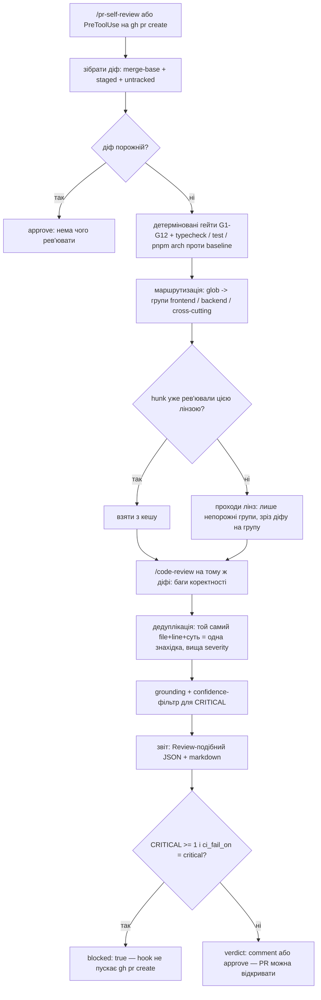

# `pr-self-review` — план скіла

Локальне self-review **перед** відкриттям PR. Відповідає на одне питання:
**чи можна це віддавати людям — і якщо ні, що саме блокує?**
Скоуп — увесь репозиторій (всі чотири пакети). Складено 2026-09-19.

---

## 1. Що це і чим воно не є

**Є:** маршрутизатор + гейт. Бере локальний діф, вирішує, **які з наявних скілів
доречні для цих файлів**, проганяє їх як рев’ю-лінзи, зводить знахідки в один
звіт у форматі продукту і виносить вердикт: `approve` / `comment` /
`request_changes`. Хоча б один CRITICAL → PR не відкривається.

**Не є:**
- не другий `/code-review` — вбудований скіл шукає баги коректності, і цей
  скіл його **викликає**, а не переписує (§ 5.3);
- не заміна CI — CI дивиться вже відкритий PR, ми дивимось те, чого ще нема на GitHub;
- не лінтер — у репозиторії **немає жодного `lint`-скрипта** (перевірено в усіх
  чотирьох `package.json`), детерміновані гейти — це `typecheck`, `test`,
  `pnpm arch` і правила з `AGENTS.md`;
- не нова модель рев’ю — вся термінологія береться з продукту (§ 6).

---

## 2. Тригери: як це запускається

Вимога — «перед кожним відкриттям PR **або** вручну». Це два різні механізми.

| Спосіб | Механізм | Стан у репо |
|---|---|---|
| Вручну | `/pr-self-review` — скіл user-invocable (як `/engineering-insights`) | працює одразу, нічого не треба |
| Перед PR | **hook `PreToolUse` на `Bash`**, матч на `gh pr create` / `git push -u` | `.claude/settings.json` **не існує** — треба створити |
| Перед PR (альтернатива) | git `pre-push` у `.githooks/` + `core.hooksPath` | версіонується, але shell-скрипт не може покликати LLM-рев’ю — тільки нагадати |
| «Перед PR» на GitHub | Actions | **не підходить**: це вже після відкриття PR |

**Пропозиція:** hook-воротар + скіл-ревізор, розділені.

1. `PreToolUse` перехоплює `gh pr create`;
2. hook читає `.devdigest/cache/pr-self-review/last-run.json`;
3. блокує (exit 2) і повертає агентові текст, якщо звіту немає, він **застарів**
   (`head_sha` ≠ поточний `HEAD`, або діф змінився) або `blocked: true`;
4. агент бачить причину, запускає `/pr-self-review`, лагодить, повторює.

Hook сам нічого не аналізує — він лише перевіряє свіжість вердикту. Це єдиний
спосіб зробити «заборонено мержити» реальною забороною, а не проханням у промпті.

> Це закриває відкрите питання з кореневого `INSIGHTS.md` («Open Questions»,
> 2026-09-15) про scoped- vs global-hooks — тут hook **мусить** бути глобальним у
> `.claude/settings.json`: сесія, яка відкриває PR, може ніколи не завантажити скіл.

Windows: hook-команду писати під `bash` явно (`bash -lc`), host — Windows 11,
дефолтний shell у сесії — PowerShell.

---

## 3. Що таке «всі відкриті зміни»

Чотири різні набори, і їх не можна плутати:

```sh
BASE=$(git merge-base origin/main HEAD)
git diff --unified=3 $BASE                 # закомічене на гілці + незакомічене tracked
git diff --cached                          # staged
git ls-files --others --exclude-standard   # нові файли, яких git ще не бачить
```

Правила відбору:

- **база — `origin/main`, не `main`**: локальний `main` відстає, і тоді в діф
  потрапляє чужа робота;
- **untracked файли обов’язково**: новий `service.ts`, який ще не додали, — це
  найчастіше саме те, що варто перевірити;
- **виключити**: `server/clones/**` (це чужий чекаут самого dev-digest, див.
  кореневий `INSIGHTS.md`, 2026-09-16), `node_modules/`, `dist/`, `.next/`;
- **лок-файли не рев’юються, а перевіряються правилом** (§ 7.1, G2);
- **межа розміру**: > 1500 змінених рядків → перемикатись на файл-за-файлом
  (продуктова стратегія `map-reduce` у `ReviewStrategy`), інакше one-pass;
- **CRLF-пастка**: якщо `git diff --numstat` показує, що файл переписано цілком,
  а логічна зміна маленька — це перевернуті закінчення рядків, а не зміна. Скіл
  повинен це **назвати** (WARNING), а не рев’ювати 400 «нових» рядків
  (кореневий `INSIGHTS.md`, 2026-09-16).

---

## 4. Інвентаризація скілів: що з них взагалі є лінзою

Прочитано frontmatter усіх 13 пакетів у `.claude/skills/`. Вони **не однорідні**:

| Скіл | Тип | Придатний як рев’ю-лінза |
|---|---|---|
| `security` | рубрика з рівнями довіри (HIGH/MEDIUM/LOW) | **так, еталон** |
| `react-best-practices` | правила з тегами CRITICAL/HIGH/MEDIUM | **так** |
| `frontend-ui-architecture` | локальний, має `references/enforcement.md` + чеклист | **так** |
| `onion-architecture` | локальний; має **машинний форсинг** — `pnpm arch` (dependency-cruiser) | **так, і частина його перевірок взагалі не потребує моделі** |
| `next-best-practices` | правила «роби так» | так, але без severity |
| `fastify-best-practices` | довідник API | частково — треба витягти чеклист |
| `drizzle-orm-patterns` | довідник патернів | частково |
| `postgresql-table-design` | правила схеми | так, для міграцій |
| `zod` | 43 правила з пріоритетами | так |
| `typescript-expert` | довідник | слабко — вмикати лише на type-heavy діфах |
| `react-testing-library` | гайд | лише коли в діфі є тести |
| `mermaid-diagram` | генератор | **ні** |
| `engineering-insights` | пост-процес | **ні** (запускається окремо, наприкінці) |

**Головна знахідка:** лише 2 із 13 скілів мають власний словник серйозності, і
жоден не має глобів, до яких він застосовний. Тобто:

- маршрутизація (§ 5) **мусить жити в цьому скілі** — у продуктовому контракті
  `Skill` (`shared/contracts/knowledge.ts:121`) полів шляху/глоба немає;
- кожному скілу потрібен **адаптер серйозності** — таблиця «правило цього скіла
  порушено → яка наша severity». Це файл `references/severity-map.md`, і без
  нього «critical finding» означатиме різне в різних лінзах.

Скіли, підтягнуті з community (`skills-lock.json`: `mcollina/skills`,
`vercel-labs/next-skills`, `wshobson/agents`, …), **не можна редагувати під нас** —
оновлення перезапише. Адаптер серйозності тому живе тут, а не в них.

---

## 5. Маршрутизація: glob → лінзи

### 5.1 Таблиця

Побудована з реального дерева (`client/src/{app,components,lib,i18n,test}`,
`server/src/{modules,adapters,db,platform,prompts}`, `reviewer-core/src`).

| Змінений шлях | Лінзи |
|---|---|
| `client/src/app/**`, `client/src/components/**` | `frontend-ui-architecture`, `react-best-practices`, `next-best-practices` |
| `client/src/app/**/{page,layout,route}.tsx` | + `next-best-practices` з підвищеним пріоритетом (RSC-межа, async API) |
| `client/src/lib/**` | `frontend-ui-architecture`, `typescript-expert` |
| `client/src/**/*.test.tsx` | `react-testing-library` |
| `server/src/modules/*/routes.ts`, `server/src/app.ts`, `server/src/platform/**` | `fastify-best-practices`, `onion-architecture`, `security` |
| `server/src/modules/*/service.ts`, `run-executor.ts`, `pipeline/**` | `onion-architecture` |
| `server/src/modules/*/repository*.ts`, `server/src/db/**` | `drizzle-orm-patterns`, `onion-architecture` |
| `server/src/db/schema.ts`, `server/drizzle/**` | `postgresql-table-design`, `drizzle-orm-patterns` |
| `server/src/adapters/**` | `onion-architecture`, `security` |
| `reviewer-core/src/**` | `onion-architecture` (три інваріанти: zero I/O, grounding, injection guard), `typescript-expert` |
| `*/vendor/shared/contracts/*.ts` | `zod` + **дзеркальне правило** (§ 7.1, G1) |
| `e2e/**` | лінзи немає — чеклист із `e2e/AGENTS.md` |
| `docs/agent-prompts/**` | лінзи немає — чеклист із `docs/agent-prompts/README.md` |
| будь-що з `process.env`, `secrets`, `token`, `auth` у доданих рядках | `security` — за **вмістом**, не за шляхом |
| `server/**`, `reviewer-core/**` із запитами, циклами, зовнішнім I/O | `perf`-лінза з `docs/agent-prompts/performance-reviewer.md` (§ 5.4) |
| `*.md`, `.github/**/*.yml` | без LLM-лінз; лише детерміновані правила |

### 5.2 Як групуються виклики

Одна лінза на скіл = 8–10 проходів по діфу на середньому PR. Це дорого і шумно.
Групуємо в **максимум три проходи**, кожен зі своїм набором скілів і **лише зі
своїм зрізом діфу**:

- **frontend** — файли `client/**`;
- **backend** — `server/**` + `reviewer-core/**`;
- **cross-cutting** — контракти, `security`-тригери, детерміновані порушення.

Порожня група не запускається взагалі. Це і є «UI-скіли на UI-файлах».

> Якщо прохід виноситься в субагента — скіл мусить **явно це дозволити**:
> дефолтна поведінка гарнеса — не використовувати Agent без прохання.
> Пропозиція: субагенти лише коли груп ≥ 2 і діф > 400 рядків.

### 5.3 Розподіл ролей із `/code-review`

Дублювати пошук багів немає сенсу. Розподіл:

| Що шукаємо | Хто |
|---|---|
| баги коректності в діфі | вбудований `/code-review` (він саме для цього) |
| відповідність архітектурі й конвенціям репозиторію | лінзи з § 5.1 |
| порушення жорстких правил `AGENTS.md` | детерміновані гейти (§ 7) |
| зведення, severity, вердикт, блокування | **цей скіл** |

### 5.4 Промпти з `docs/agent-prompts/` — теж лінзи

У `docs/agent-prompts/` уже лежать три написані рубрики рев’ю, налаштовані саме
на наш стек (Fastify 5, Drizzle над postgres-js із пулом ~10, p-queue, octokit,
pgvector): `general-reviewer.md`, `security-reviewer.md`, `performance-reviewer.md`.
План бере звідти лише визначення severity — це марнотратство.

- **`performance-reviewer.md` закриває єдину діру в таблиці § 5.1**: perf-скіла в
  нас немає взагалі, а цей промпт уже перелічує N+1 у Drizzle, відсутній індекс,
  over-fetching, голодування пулу з’єднань і блокування event loop.
- **`security-reviewer.md`** — другий погляд поряд зі скілом `security`, який
  написаний під React+Express+Mongo, тобто не під наш стек. Наш промпт — під наш.
- **`general-reviewer.md`** — вже джерело рубрики (§ 6); як лінза не потрібен,
  бо його роль виконує `/code-review`.

Ціна — нуль: файли існують, їх треба лише під’єднати. Правило супроводу: ці
промпти — джерело істини для built-in агентів продукту (`docs/agent-prompts/README.md`),
тож скіл їх **читає, а не копіює**, інакше локальна і продуктова планки розійдуться.

---

## 6. Словник серйозності — беремо з продукту, не вигадуємо

Це головне рішення плану: **локальне self-review говорить тією ж мовою, що і
продукт, який ми пишемо.** Нічого нового не вводимо:

| Що | Звідки | Значення |
|---|---|---|
| `Severity` | `shared/contracts/findings.ts:11` | `CRITICAL` / `WARNING` / `SUGGESTION` |
| `FindingCategory` | там само, :14 | `bug` / `security` / `perf` / `style` / `test` |
| `Verdict` | там само, :26 | `request_changes` / `approve` / `comment` |
| `Finding` | там само, :59 | `file`, `start_line`, `end_line`, `rationale`, `confidence` 0..1 |
| `SeverityCounts` | там само, :34 | завжди всі три ключі, відсутня severity = 0 |
| **правило блокування** | `CiFailOn`, `shared/contracts/knowledge.ts:173` | `never` / `critical` / `warning` / `any`, дефолт **`critical`** |
| визначення CRITICAL | `docs/agent-prompts/general-reviewer.md:53-73` | дослівно, щоб локально і в студії планка була одна |

Дефолт гейта — `critical`: **блокуємо тоді і тільки тоді, коли є ≥ 1 CRITICAL.**
Це рівно те, що просить завдання, і рівно те, що вже є дефолтом у продукті.

### 6.1 Два запобіжники проти хибного блокування

Блокуючий CRITICAL мусить пройти обидва:

1. **Grounding** — `start_line`/`end_line` перетинають реальний hunk діфу. Це
   дзеркало продуктового гейта (`reviewer-core/src/grounding.ts`). Знахідка без
   рядка в діфі **не блокує ніколи**, максимум WARNING.
2. **Confidence ≥ 0.7** + модель рівнів довіри зі скіла `security`: «патерн +
   підтверджений attacker-controlled input» = HIGH = блокує; «патерн, джерело
   невідоме» = MEDIUM = WARNING, не блокує.

Плюс дослівне правило з `general-reviewer.md:62`: стилістика і «я б зробив
інакше» — максимум WARNING, ніколи не CRITICAL.

---

## 7. Детерміновані гейти (перед будь-якою LLM-лінзою)

Дешеві, об’єктивні, без моделі. Проганяються першими; якщо падають — LLM-проходи
можна взагалі не запускати.

### 7.1 Правила з `AGENTS.md`, які машинно перевіряються

| # | Правило | Перевірка | Severity |
|---|---|---|---|
| G1 | `@devdigest/shared` вендорений двічі | файл змінено в `server/src/vendor/shared/X`, а `client/src/vendor/shared/X` — ні (або діфи різні) | **CRITICAL** |
| G2 | лок-файл змінюється лише в коміті про залежність | у діфі є `*-lock.yaml` / `package-lock.json`, а subject коміта не про залежності | **CRITICAL** |
| G3 | `main` — курсовий стартер | поточна гілка = `main` і в діфі є зміни коду | **CRITICAL** |
| G4 | секрети не потрапляють у git | `.env`, приватні ключі, рядки, схожі на токени (`ghp_`, `sk-`) у доданих рядках | **CRITICAL** |
| G5 | міграції не застосовуються на старті | у діфі нова міграція → нагадати, що `pnpm db:migrate` треба прогнати вручну | WARNING |
| G6 | один факт — одна домівка | зміст `README.md` продубльовано в `AGENTS.md` | SUGGESTION |
| G7 | нова фіча без запису в `specs/` | новий модуль/роут без відповідного спека | SUGGESTION |

G5 має **окрему пастку на Windows**: `db:migrate` і `db:seed` тут завершуються з
кодом 0, нічого не зробивши, — тому формулювання гейта не «прогони команду», а
«перевір кількість таблиць».

### 7.2 Пакетні перевірки — тільки для торкнутих пакетів

| Торкнуто | Команда (з теки пакета) |
|---|---|
| `server/**` | `pnpm typecheck`, `pnpm test`, **`pnpm arch`** |
| `client/**` | `pnpm typecheck`, `pnpm test` |
| `reviewer-core/**` | `npm run typecheck`, `npm test` |
| `e2e/**` | `npm run typecheck` (сам прогін — окремо, він потребує стека) |

**`pnpm arch` — найдешевша бекенд-перевірка, яка в нас є.** `onion-architecture`
приніс `server/.dependency-cruiser.cjs`, де кожне правило — `error`, а 25 наявних
боргів винесені в `.dependency-cruiser-known-violations.json`. Тобто `pnpm arch`
падає **лише на новому** порушенні межі. Це означає дві речі для нас:

- порушення кільця в діфі виявляє команда за секунди — LLM-лінза `onion-architecture`
  потрібна вже тільки для того, чого граф імпортів не бачить (бізнес-правило, що
  переїхало в `routes.ts` без жодного імпорту);
- **baseline-механіка з § 7.2 — не винахід, а наявна в репо конвенція.** Наш
  `baseline.json` для тестів робить із червоними тестами рівно те, що
  `arch:baseline` робить із боргом по межах, включно з правилом «переписувати
  тільки щоб прибрати запис».

### 7.3 Гейт повноти — «чи зміна доведена до кінця»

Це те, що людина-рев’юер перевіряє першим, а модель пропускає. Усе нижче
перевіряється зі швів, які в репозиторії вже є, без виклику моделі.

| # | Шов | Перевірка | Severity |
|---|---|---|---|
| G8 | реєстрація модуля | новий роут у `modules/*/routes.ts`, якого немає в `server/src/modules/index.ts` | **CRITICAL** |
| G9 | схема ↔ міграція | змінено `server/src/db/schema.ts`, але в `server/drizzle/` немає нової міграції | **CRITICAL** |
| G10 | контракт ↔ споживач | змінено `*/vendor/shared/contracts/*.ts`, обидві копії дзеркальні (G1 ок), але жоден файл `client/src` не оновлено | WARNING |
| G11 | тест у правильній сюїті | новий `*.test.ts`, що потребує Postgres, без суфікса `*.it.test.ts`; або нова логіка в `src/**` без жодного тесту в сюїті, яку `TESTING.md` призначає цьому пакету | WARNING |
| G12 | текст в UI | доданий літерал тексту в JSX замість ключа через next-intl / `client/messages/en/*.json` | WARNING |

G11 свідомо м’який: `TESTING.md` прямо каже, що покриття ми не переслідуємо —
гейт нагадує про сюїту, а не вимагає тест на кожен рядок. G8 і G9 — CRITICAL,
бо це зміна, яка просто не працює: роут, якого немає в застосунку, і схема без
міграції.

**Baseline, інакше гейт нежиттєздатний.** На чистому дереві тут частина тестів
уже червона (6 з 11 в `indexer-pipeline.test.ts`). Правило: падіння блокує лише
тоді, коли **воно з’явилося** — порівнюємо зі списком відомо-червоних із
`.devdigest/cache/pr-self-review/baseline.json` (оновлюється прогоном на
merge-base). Без baseline гейт блокував би кожен PR і його б вимкнули першого дня.

---

## 8. Конвеєр



Дедуплікація (крок H) обов’язкова: `security` і `/code-review` знайдуть ту саму
ін’єкцію, `frontend-ui-architecture` і `react-best-practices` — те саме розпухле
`page.tsx`. Ключ дедупу: `file` + перетин діапазону рядків + нормалізований
заголовок.

---

## 9. Звіт

Пише в **`.devdigest/cache/pr-self-review/`** — цей шлях уже в `.gitignore`
(`.devdigest/cache/`), тож нічого додавати не треба.

```
.devdigest/cache/pr-self-review/
├── last-run.json     # вердикт, який читає hook
└── baseline.json     # відомо-червоні тести на merge-base
```

`last-run.json` — форма продуктового `Review` плюс поля свіжості:

```jsonc
{
  "head_sha": "…",            // проти чого рахували; hook порівнює з HEAD
  "diff_hash": "…",           // щоб зловити незакомічені правки після рев’ю
  "base": "origin/main",
  "generated_at": "2026-09-19T…Z",
  "ci_fail_on": "critical",
  "blocked": true,
  "degraded": false,           // true = бюджет вичерпано, частина лінз не відпрацювала
  "verdict": "request_changes",
  "summary": "…",
  "counts": { "CRITICAL": 1, "WARNING": 4, "SUGGESTION": 7 },
  "delta": { "fixed": 2, "new": 1, "still_open": 1 },   // проти попереднього прогону
  "findings": [ { "id": "a3f1…",              // хеш file + заголовок + вміст hunk'а
                  "status": "open",           // open | fixed | suppressed
                  "severity": "CRITICAL", "category": "security",
                  "file": "server/src/modules/pulls/routes.ts",
                  "start_line": 238, "end_line": 240,
                  "lens": "onion-architecture", "confidence": 0.86,
                  "grounded": true, "rationale": "…", "suggestion": "…" } ],
  "lenses_run": ["frontend-ui-architecture", "security", "perf-prompt", "code-review"],
  "lenses_skipped": [],
  "gates": { "G1": "pass", "G8": "pass", "typecheck": "pass",
             "arch": "pass", "tests": "baseline" },
  "override": null
}
```

Поле `lens` — наше доповнення до продуктового `Finding`: треба знати, який скіл
це сказав, інакше неможливо ні довіряти, ні калібрувати. Форма навмисне близька
до `Review`, щоб той самий звіт потім згодився для L06 («Export to CI»,
`agent-runner/`) без переписування.

У термінал — коротка таблиця + один рядок вердикту. Повний текст не вивалюємо.

---

## 10. Блокування і override

- `blocked: true` → hook повертає exit 2 з переліком CRITICAL. `gh pr create` не
  виконується.
- **Override мусить існувати**, інакше одна хибнопозитивна знахідка блокує
  роботу назавжди: `/pr-self-review --override "<причина>"`. Причина
  **обов’язкова**, пишеться в `override` і потрапляє в тіло PR окремим рядком —
  щоб обхід був видимим, а не тихим.
- Звіт застарів (`head_sha` або `diff_hash` розійшлись) → це **не** «пропустити»,
  це «прогнати ще раз». Інакше достатньо зарев’ювати чистий стан і потім
  дописати що завгодно.

---

## 11. Структура пакета скіла

За зразком `frontend-ui-architecture`:

```
.claude/skills/pr-self-review/
├── SKILL.md                      # процедура від тригера до вердикту (~300 рядків)
├── references/
│   ├── routing.md                # таблиця § 5 + як її розширювати новим скілом
│   ├── severity-map.md           # адаптери серйозності для кожної лінзи (§ 4)
│   ├── gates.md                  # G1-G12 + pnpm arch + baseline + точні команди
│   ├── do-not-flag.md            # джерела хибних спрацювань у цьому репо (§ 16.2)
│   ├── report.md                 # схема last-run.json + контракт виводу (§ 9, § 16.3)
│   └── hook.md                   # готовий блок для .claude/settings.json
├── examples.md                   # 3 приклади: блокуючий, не-блокуючий, хибнопозитивний
├── evals/
│   ├── evals.json
│   └── fixtures/                 # готові .diff (§ 12)
├── RESEARCH.md                   # робочі нотатки
└── README.md                     # опис файлів + джерела
```

Поза пакетом: рядок у каталозі `.claude/skills/README.md`, рядок у таблиці Skills
кореневого `AGENTS.md`, і **новий `.claude/settings.json`** із hook’ом.

`description` у frontmatter має тригеритись на: «відкрий PR», «створи pull
request», «перевір мої зміни перед PR», «self-review», «можна це мержити?»,
`/pr-self-review`.

---

## 12. Евали

Формат наявного `evals/evals.json`. Мінімум чотири кейси, кожен — фікстура-діф:

1. **Маршрутизація.** Діф торкається `client/src/app/**` і `server/src/db/schema.ts`.
   Перевіряємо: піднялись `frontend-ui-architecture` + `postgresql-table-design`,
   і **не піднялись** `fastify-best-practices`, `react-testing-library`.
2. **Блокування.** Діф із реальним CRITICAL (загублений `workspace_id` у запиті).
   Перевіряємо: `blocked: true`, `verdict: request_changes`, знахідка grounded,
   у звіті названо рядок.
3. **Не-блокування.** Діф із трьома SUGGESTION і одним WARNING.
   Перевіряємо: `blocked: false`, PR можна відкривати, шум не підвищено до CRITICAL.
4. **Хибнопозитив.** Знахідка без рядка в діфі («десь у цьому файлі, мабуть,
   витік»). Перевіряємо: не CRITICAL, не блокує — спрацював grounding.

Плюс два кейси без жодного виклику моделі:

5. **G1.** Змінено лише `server/src/vendor/shared/contracts/findings.ts` → CRITICAL
   про незеркалену копію.
6. **Гейт повноти.** Новий роут у `modules/webhooks/routes.ts`, не зареєстрований
   у `modules/index.ts` → G8 CRITICAL, і жодна LLM-лінза для цього не потрібна.

**Канарейка.** Кейс 2 (блокуючий діф) виноситься окремою фікстурою, яку ганяємо в
CI разом із евалами: гейт, що ніколи не спрацьовує, — зламаний гейт, і помітити
це інакше неможливо. Рефакторинг скіла, який тихо вимкнув блокування, має валити
цей прогін.

---

## 13. Етапи

| Етап | Що робимо | Обсяг |
|---|---|---|
| 0 | гілка `skill/pr-self-review`; закрити § 14 | — |
| 1 | `references/gates.md` (G1–G12, `pnpm arch`, baseline) + збір діфу — **найдешевша половина цінності, працює без LLM** | ~250 рядків |
| 2 | `references/routing.md` + `severity-map.md` + список «не флагати» (§ 16.2) | ~350 |
| 3 | `SKILL.md` — процедура, дедуп, grounding, вердикт, контракт виводу (§ 16.3) | ~300 |
| 4 | кеш і дельта-звіт (§ 16.1) + бюджет із `degraded` (§ 16.4) | ~150 |
| 5 | `references/hook.md` + `.claude/settings.json`, перевірка на реальному `gh pr create`; чернетка тіла PR (§ 16.6) | ~150 + прогін |
| 6 | `evals/` + фікстури + канарейка, `examples.md`, `README.md`, рядки в каталозі і `AGENTS.md` | ~250 |
| 7 | `/engineering-insights` | — |

Етапи 1 і 2 корисні самі по собі: детерміновані гейти ловлять G1–G4 і G8–G9 ще
до того, як з’явиться хоч одна LLM-лінза. Етап 4 не косметичний — без нього
другий прогін коштує як перший, і скіл перестають запускати.

---

## 14. Рішення, які треба прийняти до старту

1. **Hook блокує чи попереджає?** Пропозиція: блокує (exit 2) — інакше це не
   «заборонити мержити», а порада. Override із § 10 робить це безпечним.
2. ~~**Чи чекаємо на `onion-architecture`?**~~ **Закрито:** скіл написаний, і разом
   із ним у репо з’явились `server/.dependency-cruiser.cjs`, `pnpm arch` і
   baseline на 25 боргів. Бекенд-група стартує одразу з ним, а частина його
   перевірок узагалі переїжджає в детерміновані гейти (§ 7.2).
3. **`ci_fail_on` фіксований чи налаштовний?** Пропозиція: дефолт `critical`,
   значення читається з опційного `.devdigest/pr-self-review.json` у репо — так
   само, як продукт тримає його на агенті.
4. **Субагенти чи послідовні проходи?** Пропозиція: послідовно до 400 рядків
   діфу, далі — по субагенту на групу.
5. **Чи ганяємо `pnpm test` у гейті, чи лише `typecheck`?** Тести
   server-integration потребують Docker і тут довгі. Пропозиція: `typecheck`
   завжди, `test` — лише для пакетів, у яких змінено `src/**`, і завжди проти
   baseline.
6. **Хто оновлює `baseline.json`?** Пропозиція: окремий прапорець
   `/pr-self-review --refresh-baseline`, ніколи не автоматично — інакше
   свіжозламаний тест тихо стане «відомо червоним». Це дослівно правило
   `pnpm arch:baseline` з `onion-architecture`: «переписувати тільки щоб
   **прибрати** запис».
7. **Чи блокує гейт повноти (§ 7.3) на рівні CRITICAL?** G8 і G9 — так
   (зміна просто не працює). G10–G12 — WARNING. Питання в тому, чи не занадто
   це строго для WIP-гілки: пропозиція — так само строго, для WIP є `--override`.

---

## 15. Ризики

- **Хибнопозитивний CRITICAL** — головний ризик: один такий, і скіл вимикають.
  Мітигація: grounding + confidence ≥ 0.7 + обов’язковий override.
- **Шум.** 13 скілів на один діф дадуть сотні SUGGESTION. Мітигація: блокує лише
  CRITICAL, у термінал іде вердикт і CRITICAL/WARNING, решта — у JSON.
- **Ціна.** До трьох проходів + `/code-review`. Мітигація: порожні групи не
  запускаються, детерміновані гейти йдуть першими і можуть зупинити все раніше.
- **Дрейф із продуктом.** Якщо `Severity` чи `CiFailOn` у контрактах зміняться,
  скіл почне брехати. Мітигація: `severity-map.md` посилається на файл і рядок,
  а не копіює значення; в евали додати кейс, що ловить розбіжність.
- **Скіл рев’ює сам себе.** Зміна в `.claude/skills/**` не має піднімати лінзи —
  тільки детерміновані гейти.
- **Протухлий кеш (§ 16.1).** Знахідка, яку кеш вважає `fixed`, бо змінився
  сусідній рядок, — це тихо пропущений CRITICAL. Мітигація: ключ кешу — вміст
  hunk’а, а не номери рядків; кеш скидається при зміні лінзи або її версії; і
  кеш **ніколи не застосовується до CRITICAL** — їх перевіряємо щоразу заново.

---

## 16. Ергономіка: що робить скіл придатним до щоденного вжитку

Гейт, який незручно запускати, вимикають. Ці пункти не про якість знахідок, а про
те, чи скіл доживе до десятого PR.

### 16.1 Інкрементальний повторний прогін

Реальний цикл — не один прогін, а «прогнав → полагодив два CRITICAL → прогнав ще
раз». Якщо другий прогін коштує стільки ж, скіл вимкнуть на третьому PR.

- **Стабільний `id` знахідки** — хеш `file` + нормалізований заголовок + вміст
  hunk’а (не номер рядка: він з’їде від першої ж правки вище).
- **Кеш** по ключу `(hunk_hash, lens)` у `.devdigest/cache/pr-self-review/` —
  незмінений hunk не перерев’юється.
- **Дельта-звіт**: «2 виправлено, 1 нова, 1 лишилась». Побічний ефект — видно,
  чи автор полагодив проблему, чи просто пересунув код.
- **Життєвий цикл знахідки**: `open` → `fixed` (hunk змінився і лінза більше її
  не бачить) → `suppressed` (§ 16.2). `override` (§ 10) — це рішення про весь
  прогін, suppression — про одну знахідку.

### 16.2 Список «не флагати» — під цей репозиторій

Як `Do NOT flag` у скілі `security`, але з нашими джерелами хибних спрацювань:

- **навмисні прогалини стартера** — `main` це курсовий стартер, порожня таблиця
  інтенційна, ненаписана фіча з таблиці лекцій — не знахідка;
- **вендоровані копії** `*/vendor/shared/**` — це не дублювання коду, це правило;
- `server/clones/**`, згенероване, `dist/`, лок-файли;
- **25 грандфазернутих порушень меж** із `.dependency-cruiser-known-violations.json`
  — про них уже є рішення, повторювати його щоразу немає сенсу.

Плюс точкове глушіння в коді: `// dd-ignore: <rule> — <причина>`, причина
обов’язкова. Без причини коментар не діє — інакше за місяць ними буде засіяний
весь репозиторій.

### 16.3 Контракт термінального виводу

Жорстко: **≤ 15 рядків**. Рядок вердикту, CRITICAL і WARNING списком
(`file:line — заголовок`), лічильники, шлях до повного звіту. SUGGESTION у
термінал не йдуть узагалі — тільки в JSON. Без цього контракту кожна реалізація
вивалює стіну тексту, і її перестають читати саме тоді, коли там є важливе.

### 16.4 Бюджет і чесна деградація

Стеля на прогін (пропозиція: 90 секунд і три проходи). При перевищенні —
падаємо на детерміновані гейти + один прохід і ставимо `degraded: true` у звіт,
перелічивши, які лінзи не відпрацювали. Мовчки зрізане покриття гірше за
відсутнє: воно виглядає як «чисто».

### 16.5 Мова

Знахідки — українською (нею ведеться робота в цьому репозиторії), ідентифікатори,
шляхи, цитати коду і назви правил — без перекладу. `SKILL.md` і `references/` —
англійською, як решта скілів.

### 16.6 Слід рев’ю в самому PR

Скіл спрацьовує за секунду до `gh pr create` і тримає в руках і діф, і знахідки —
отже, має одразу віддавати чернетку PR:

- **заголовок** у стилі репозиторію — conventional commits зі скоупами, які тут
  реально вживані: `feat(web,contracts):`, `fix(server):`, `docs(specs):`;
- **тіло** — що змінилось і навіщо, з посиланням на `specs/`, якщо спек є;
- **блок self-review** — `CRITICAL 0 · WARNING 4 · SUGGESTION 7`, перелік лінз,
  і рядок `override: <причина>`, якщо обхід був. Обхід мусить бути видимим
  людині-рев’юеру, а не лише в локальному JSON;
- рядок атрибуції, як вимагає налаштування репозиторію.

Тоді скіл — не «ще один крок перед PR», а те, що PR і відкриває. Прецедент уже є
в історії: комміт `fix(web,contracts): the two findings the General Reviewer
raised on this PR`.

### 16.7 Наступна ітерація (не в першій версії)

Міні-контекст навколо зміненого символу — визначення + прямі виклики через
ripgrep — помітно зменшує хибні спрацювання на кшталт «немає перевірки на null»,
коли виклик її гарантує. Продукт робить це прапорцем `repo_intel` на агенті.
Вмикати після того, як запрацюють § 7 і § 16.1.

---

## 17. Джерела

### Внутрішні (перевірені в цьому репозиторії)
1. `server/src/vendor/shared/contracts/findings.ts` — `Severity`, `FindingCategory`, `Verdict`, `Finding`, `SeverityCounts`.
2. `server/src/vendor/shared/contracts/knowledge.ts:114-199` — `Skill`, `CiFailOn` (дефолт `critical`), `ReviewStrategy`, `AgentSkillLink`.
3. `docs/agent-prompts/general-reviewer.md:53-73` — дослівна рубрика CRITICAL / WARNING / SUGGESTION і правило вердикту.
4. `reviewer-core/` — grounding-гейт як зразок для § 6.1.
5. `AGENTS.md` (корінь) — жорсткі правила, з яких зроблено G1–G4.
6. `TESTING.md` — п’ять сюїт і що з них можна ганяти локально без Docker.
7. `INSIGHTS.md` (корінь) — `server/clones/`, CRLF, відкрите питання про hooks.
8. `.claude/skills/*/SKILL.md` — інвентаризація § 4; `skills-lock.json` — походження vendored-скілів.
9. `.claude/skills/frontend-ui-architecture/` — зразок структури пакета і формату `evals.json`.
10. `.claude/skills/security/SKILL.md` — модель довіри HIGH/MEDIUM/LOW, взята в § 6.1.
11. `.github/workflows/*.yml` — що вже перевіряється в CI, щоб не дублювати локально.
12. `docs/agent-prompts/{security,performance}-reviewer.md` — готові рубрики-лінзи (§ 5.4).
13. `.claude/skills/onion-architecture/SKILL.md`, `server/.dependency-cruiser.cjs`,
    `server/.dependency-cruiser-known-violations.json` (25 записів), скрипти
    `arch` / `arch:all` / `arch:baseline` у `server/package.json` — машинний
    бекенд-гейт і прецедент baseline-механіки.
14. `server/src/modules/index.ts`, `server/drizzle/`, `client/messages/en/*.json` —
    шви, з яких зроблено гейт повноти G8–G12.
15. `git log` — conventional-commit скоупи, які реально вживані в цьому репо (§ 16.6).

### Зовнішні — дочитати на етапі 1
- Claude Code: hooks (`PreToolUse`, exit-коди і блокування), формат `.claude/settings.json`, frontmatter скілів (`user-invocable`, `allowed-tools`).
- `gh pr create` — які саме форми виклику треба матчити в hook’у (включно з `gh pr create --web`).
- `git merge-base` / `git diff --merge-base` — поведінка, коли `origin/main` не підтягнутий.
- dependency-cruiser — щоб бекенд-гейт переїхав із LLM-лінзи в детермінований, щойно `onion-architecture` дасть конфіг.
