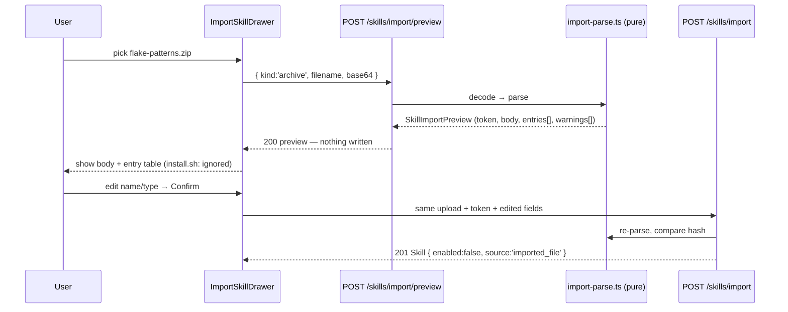
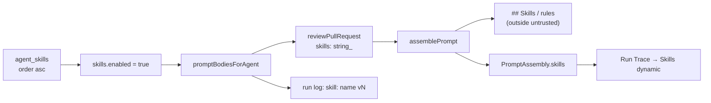

# L02 — Skills in the product

**Goal:** a user can write, edit and import reusable skill blocks in the studio,
attach them to any agent in a chosen order, and see exactly which of them landed
in a review's prompt.

**Not in scope:** skills that *do* anything. A skill is text — a name, a
description, a type and a markdown body. No tools, no code execution, no file
access, no network.

**Explicitly deferred — nothing in this lesson builds these:**

- **Evals, in any form.** No eval cases, no per-skill scoring, no *Evals* tab in
  the agent editor, no eval replay of a past agent version. The whole eval
  pipeline is L06; the mockup's `Evals` / `Stats` / `CI` tabs stay unbuilt and
  `TABS` gains **only** `skills` (§7.2). The control experiment (§9) is a manual
  A/B a human runs and reads, not an automated eval harness.
- The Conventions extractor (same lesson, separate spec).
- Import from URL and the community catalog (D1).
- Skill sharing across workspaces.

---

## 1. Decisions

Settled before writing; the rest of the document assumes them.

| # | Decision | Consequence |
|---|---|---|
| D1 | Import accepts a **markdown file or a `.zip` archive** | archive parsing is hand-rolled on `node:zlib` (`inflateRawSync`) — no new dependency |
| D2 | In the agent editor, the per-skill toggle **is** attach/detach | no `enabled` column on `agent_skills`, no migration; matches the existing string `agents.skills.orderHint` ("Toggle to attach") |
| D3 | One new agent: **Test Quality Reviewer**, with 4 skills | seeded in `server/src/db/seed.ts`; one of its skills is brought in through the import flow by hand, not seeded |
| D4 | Control experiment ships as **fixtures + a written procedure** | no LLM calls from the build; the two demo PRs are seed fixtures |
| D5 | The **API Contract** half of the experiment runs on the existing **General Reviewer** | proves reuse — one skill row (`api-contract-gate`) attached to two agents |

### D6 — the trust model (decide once, it shapes the prompt)

An enabled skill is **instructions**, not data. `assemblePrompt` renders it in a
plain `## Skills / rules` section, *outside* the `<untrusted>` delimiters that
wrap the diff, the PR body and the spec chunks. That is deliberate and it is the
whole point of the feature — a delimiter-wrapped skill would be neutralised by
`INJECTION_GUARD` (`reviewer-core/src/prompt.ts:16`, which instructs the model to
ignore any instruction inside `<untrusted>`) and could never flag anything.

The safety lives in the **lifecycle**, not the delimiter:

| Gate | Where |
|---|---|
| an imported skill is stored `enabled = false` | `SkillsService.confirmImport` |
| "needs vetting" badge until enabled | `skills.listItem.needsVetting` (string exists) |
| full body shown before the first write | the import preview step |
| nothing enters a prompt until enabled **and** attached | `run-executor` filter |
| the UI says it in words | `skills.preview.untrustedNotice` (string exists) |

This is the line the video calls out: *someone else's skill is someone else's
instructions inside your agent's prompt.*

### D7 — attaching or reordering skills bumps the agent's version

`AgentsRepository.snapshotVersion` already writes the ordered skill ids into
`AgentVersionConfig.skills` (`repository.ts:150`), but `setSkills` / `linkSkill`
do **not** snapshot today. So the moment skills reach the prompt, an agent's
version stops describing the prompt it produces: attach three skills and the
agent still says v1, while `agent_versions` records a v1 whose `skills` array is
empty. The edit history — the thing a user opens to answer *"what changed
between the run that missed it and the run that caught it?"* — would be wrong in
exactly the case this lesson is built to demonstrate.

`AgentsService.setSkills` and `.linkSkill` therefore bump the agent version and
snapshot after writing the links. This is a change to an existing module and
belongs in the same commit as the prompt wiring (step 6). It is not an eval
concern — L06 will lean on it later, but the reason to do it now is that the
version number is user-visible today.

---

## 2. What already exists

The starter left the rails in place and removed the feature. Do not rebuild
these.

| Already there | Where |
|---|---|
| `skills`, `skill_versions`, `agent_skills` tables | `server/src/db/schema/skills.ts`, `…/agents.ts`; DDL at `migrations/0000_init.sql:316` |
| `Skill`, `SkillType`, `SkillSource`, `AgentSkillLink` contracts | `vendor/shared/contracts/knowledge.ts` (both copies) |
| agent↔skill link API | `GET` / `POST /agents/:id/skills` (`modules/agents/routes.ts:146`) |
| link/reorder data access | `AgentsRepository.linkedSkills / skillIdsForAgent / linkSkill / unlinkSkill / setSkills` |
| ordered skill ids in the version snapshot | `AgentVersionConfig.skills` |
| the prompt slot | `reviewer-core/src/prompt.ts:88` builds `## Skills / rules`, records `PromptAssembly.skills` |
| the trace UI for that block | `RunTraceDrawer/_components/TraceBody/TraceBody.tsx:76`, colour at `constants.ts:16` |
| every user-facing string | `client/messages/en/skills.json`, `agents.skills.*` |
| sidebar entry + active-key routing | `app-shell/helpers.ts:33`, `shell.json:21` |

**No migration is needed.** `skills.source` is plain `text` in the DDL — the
drizzle `{ enum: [...] }` is type-level only — so adding a source value is a code
change in both vendored `shared` copies and nothing else.

## 3. What is missing

1. `server/src/modules/skills/` — the module does not exist.
2. The line that makes any of it matter: `run-executor.ts` never passes skill
   bodies to `reviewPullRequest` (`:191`) and `traceFromBuffer` hardcodes
   `skills: null` (`:429`). **Today an attached skill changes nothing.**
3. `client/src/app/skills/` — the route does not exist; the sidebar links to a 404.
4. `AgentEditor/constants.ts` ships `TABS = [config]` only, and
   `agents/[id]/page.tsx:15` gates on `VALID_TABS = ["config"]`.
5. Import — no parser, no preview, no confirm.
6. Seed data for the new agent, its skills and the fixture PRs.
7. D7 — skill-link changes do not version the agent.

---

## 4. Touches

| Package | Files |
|---|---|
| server | `modules/skills/**` (new), `modules/index.ts`, `modules/agents/service.ts` (D7), `modules/reviews/run-executor.ts`, `platform/container.ts`, `db/seed.ts`, `db/seed-prompts.ts`, `db/seed-fixtures.ts` (new), `vendor/shared/contracts/knowledge.ts` |
| client | `app/skills/**` (new), `app/agents/[id]/page.tsx`, `app/agents/[id]/_components/AgentEditor/{AgentEditor.tsx,constants.ts}`, `…/_components/SkillsTab/**` (new), `lib/hooks/skills.ts` (new), `lib/hooks/agents.ts`, `messages/en/skills.json`, `messages/en/agents.json`, `vendor/shared/contracts/knowledge.ts` |
| reviewer-core | none — the `skills` input already exists end to end |
| docs | `docs/agent-prompts/test-quality-reviewer.md`, `server/README.md`, `client/README.md` |

---

## 5. Contract

Added to `contracts/knowledge.ts` — **both vendored copies, same commit**.
Client/server drift here is the failure mode the root `AGENTS.md` names by hand.

```ts
// ── changed ────────────────────────────────────────────────────────────────
// One new value. No DB change: the column is plain text, the drizzle enum is
// type-level. The drizzle `{ enum: [...] }` list in db/schema/skills.ts gains
// it too, or inserts stop type-checking.
export const SkillSource = z.enum([
  'manual', 'imported_file', 'imported_url', 'extracted', 'community',
]);

// ── new ────────────────────────────────────────────────────────────────────

/** One body revision. Mirrors the existing `skill_versions` table. */
export const SkillVersion = z.object({
  skill_id: z.string(),
  version: z.number().int(),
  body: z.string(),
  created_at: z.string(),
});
export type SkillVersion = z.infer<typeof SkillVersion>;

/** How an archive entry was classified. Only `core` is ever decompressed. */
export const SkillImportEntryKind = z.enum(['core', 'doc', 'executable', 'other']);
export type SkillImportEntryKind = z.infer<typeof SkillImportEntryKind>;

export const SkillImportEntry = z.object({
  path: z.string(),
  bytes: z.number().int(),
  kind: SkillImportEntryKind,
  /** true for everything except `core`: named in the listing, never parsed. */
  ignored: z.boolean(),
});
export type SkillImportEntry = z.infer<typeof SkillImportEntry>;

/** The result of parsing an upload. NOTHING is persisted to produce this. */
export const SkillImportPreview = z.object({
  /** sha256 of the extracted core body — echoed back on confirm. */
  token: z.string(),
  name: z.string(),
  description: z.string(),
  type: SkillType,
  body: z.string(),
  source: SkillSource,
  entries: z.array(SkillImportEntry),
  warnings: z.array(z.string()),
});
export type SkillImportPreview = z.infer<typeof SkillImportPreview>;
```

`Skill` itself is unchanged.

---

## 6. Server

### 6.1 Module layout

Onion order is `routes.ts → service.ts → repository.ts`, never the reverse;
`pnpm arch` enforces it via `.dependency-cruiser.cjs`.

```
server/src/modules/skills/
  routes.ts          # zod-validated route declarations; no logic
  service.ts         # CRUD, versioning, import orchestration, prompt-body read
  repository.ts      # `skills` + `skill_versions`, workspace-scoped
  import-parse.ts    # PURE: bytes → SkillImportPreview. No db/fs/network.
  zip.ts             # PURE: minimal ZIP central-directory reader on node:zlib
  helpers.ts         # row → DTO, front-matter + heading extraction, classify
  constants.ts       # caps, executable extensions, core-file precedence
```

`import-parse.ts` and `zip.ts` are pure on purpose: the archive reader and the
"which entry is the skill core" rules are the part most worth unit-testing, and
they need no Postgres — they land in the fast `*.test.ts` suite.

### 6.2 Exported signatures

**`repository.ts`**

```ts
export interface InsertSkill {
  workspaceId: string;
  name: string;
  description: string;
  type: SkillType;
  source: SkillSource;
  body: string;
  enabled?: boolean;            // default true; the import path passes false
  evidenceFiles?: string[];
}

export interface UpdateSkill {
  name?: string; description?: string; type?: SkillType;
  body?: string; enabled?: boolean;
}

export class SkillsRepository {
  constructor(private db: Db) {}

  list(workspaceId: string): Promise<SkillRow[]>;              // name asc
  getById(workspaceId: string, id: string): Promise<SkillRow | undefined>;
  getManyByIds(workspaceId: string, ids: string[]): Promise<SkillRow[]>;
  insert(values: InsertSkill): Promise<SkillRow>;              // + v1 snapshot
  update(workspaceId: string, id: string, patch: UpdateSkill): Promise<SkillRow | undefined>;
  deleteById(workspaceId: string, id: string): Promise<boolean>;
  listVersions(skillId: string): Promise<SkillVersionRow[]>;   // version desc
  countAgentsUsing(workspaceId: string, skillId: string): Promise<number>;
}
```

`SkillRow` / `SkillVersionRow` are added to `src/db/rows.ts` next to `AgentRow`.

**The versioning rule** mirrors `agents/helpers.ts:isConfigChange`: only the
**body** is versioned. `insert` writes `version: 1` and the matching
`skill_versions` row. `update` compares the incoming body to the stored one —
equal or absent → touch nothing; different → `version + 1`, and insert the **new**
body into `skill_versions` at the new version. Name / description / type /
enabled edits never bump the version. `skill_versions` therefore holds every
revision including the current one, keyed `(skill_id, version)` — the primary key
the table already declares.

**`service.ts`**

```ts
export class SkillsService {
  constructor(private container: Container) { this.repo = new SkillsRepository(container.db); }

  list(workspaceId: string): Promise<Skill[]>;
  get(workspaceId: string, id: string): Promise<Skill | undefined>;
  create(workspaceId: string, input: CreateSkillInput): Promise<Skill>;
  update(workspaceId: string, id: string, patch: UpdateSkillInput): Promise<Skill | undefined>;
  delete(workspaceId: string, id: string): Promise<boolean>;
  versions(workspaceId: string, id: string): Promise<SkillVersion[] | undefined>;

  /** Parse only. Writes nothing. Throws ValidationError on a bad upload. */
  previewImport(input: ImportUpload): Promise<SkillImportPreview>;

  /** Re-parses, verifies `token`, then persists with enabled:false. */
  confirmImport(workspaceId: string, input: ConfirmImportInput): Promise<Skill>;

  /**
   * Ordered bodies for the agent's prompt: attached order, globally-enabled
   * only. The ONE read the review path uses. Returns [] for an agent with
   * no skills so `assemblePrompt` omits the section.
   */
  promptBodiesForAgent(agentId: string): Promise<PromptSkill[]>;
}

export interface PromptSkill { id: string; name: string; version: number; body: string }
```

`previewImport` is `async` only for symmetry — it does no I/O and can be called
from a test without a container.

### 6.3 API reference

All routes are workspace-scoped via `getContext(app.container, req)`; a row in
another workspace is a **404, never a 403**, so the response does not confirm
that an id exists. Validation is schema-first (`fastify-type-provider-zod`) —
invalid input fails with 422 before the handler runs. Errors are thrown as
`AppError` subclasses and rendered by the global handler as
`{ error: { code, message, details } }`.

#### `GET /skills`

List every skill in the workspace, `name` ascending.

```
200 → Skill[]
```

#### `GET /skills/:id`

```
params: IdParams                     // uuid, from modules/_shared/schemas.ts
200 → Skill
404 not_found                        // missing, or another workspace's
422 validation_error                 // :id is not a uuid
```

#### `POST /skills`

Create by hand. `source` is forced to `'manual'` — the client cannot claim a
provenance it did not go through.

```jsonc
// body
{
  "name": "uncovered-branch-gate",
  "description": "For each changed function, enumerate its branches and name the ones no test reaches.",
  "type": "rubric",                  // rubric | convention | security | custom
  "body": "# Uncovered branch gate\n…",
  "enabled": true                    // optional, default true
}
```

```
201 → Skill                          // version 1, source "manual"
422 validation_error                 // empty name/description/body, unknown type
```

#### `PUT /skills/:id`

Partial update. A changed `body` bumps `version` and appends to `skill_versions`
(§6.2); everything else does not.

```jsonc
// body — every field optional
{ "name": "…", "description": "…", "type": "rubric", "body": "…", "enabled": false }
```

```
200 → Skill                          // `version` reflects the bump, if any
404 not_found
422 validation_error
```

#### `DELETE /skills/:id`

```
200 → { ok: true, unlinked_from: number }   // agents that lost the skill
404 not_found
```

`agent_skills` rows cascade at the DB level (`references(… onDelete: 'cascade')`),
so the service reads `countAgentsUsing` **before** deleting and returns it — the
client uses it for the confirm copy ("used by 2 agents").

#### `GET /skills/:id/versions`

```
200 → SkillVersion[]                 // newest first
404 not_found
```

#### `POST /skills/import/preview`

Parse an upload and return what *would* be stored. **Writes nothing.**

```ts
// route options
{
  bodyLimit: 4 * 1024 * 1024,        // app.ts:49 sets 1 MiB globally; base64 +33%
  schema: { body: ImportBody },
}

const ImportBody = z.discriminatedUnion('kind', [
  z.object({ kind: z.literal('markdown'), filename: z.string().min(1), text: z.string().min(1) }),
  z.object({ kind: z.literal('archive'),  filename: z.string().min(1), base64: z.string().min(1) }),
]);
```

```jsonc
// 200 → SkillImportPreview
{
  "token": "b1946ac92492d2347c6235b4d2611184…",
  "name": "flake-patterns",
  "description": "Flag sleeps, real clocks, order-dependent fixtures and network calls in unit tests.",
  "type": "convention",
  "body": "# Flake patterns\n…",
  "source": "imported_file",
  "entries": [
    { "path": "SKILL.md",    "bytes": 1840, "kind": "core",       "ignored": false },
    { "path": "README.md",   "bytes": 320,  "kind": "doc",        "ignored": true  },
    { "path": "install.sh",  "bytes": 96,   "kind": "executable", "ignored": true  }
  ],
  "warnings": [
    "install.sh is executable — listed only, never read or run.",
    "2 of 3 entries were ignored."
  ]
}
```

Failures, all `AppError` subclasses:

| Status | code | When |
|---|---|---|
| 422 | `no_skill_core` | archive contains no `.md` |
| 422 | `unsupported_archive` | not a ZIP (no end-of-central-directory record) |
| 422 | `unsafe_entry_path` | an entry name escapes the archive root |
| 413 | `archive_too_large` | decoded archive > 2 MiB, or an entry > 256 KiB |
| 413 | — | Fastify's own limit, before the handler, if base64 > 4 MiB |

`no_skill_core`, `unsupported_archive`, `unsafe_entry_path` are
`ValidationError` subclasses (422); `archive_too_large` is a new
`PayloadTooLargeError extends AppError` with status 413, added to
`platform/errors.ts`.

#### `POST /skills/import`

Persist a previewed skill.

```jsonc
// body = the same ImportBody, plus the confirmed fields
{
  "kind": "archive",
  "filename": "flake-patterns.zip",
  "base64": "UEsDBBQ…",
  "token": "b1946ac92492d2347c6235b4d2611184…",
  "name": "flake-patterns",          // user may have edited these three
  "description": "…",
  "type": "convention"
}
```

The server **re-parses** the upload and compares the fresh core hash to `token`.
Match → persist with `source: 'imported_file'` and **`enabled: false`** (D6).
Mismatch → 409.

```
201 → Skill                          // enabled:false, version 1
409 import_changed                   // the body is not the one that was previewed
422 / 413                            // same as preview
```

Re-parsing rather than caching the preview keeps the server stateless — no TTL,
no eviction, nothing to leak between workspaces — at the cost of inflating the
archive twice. At a 2 MiB cap that is not a cost worth a cache.

#### Unchanged, on the agent side

```
GET  /agents/:id/skills   → AgentSkillLink[]   (ordered)
POST /agents/:id/skills   { skill_ids: string[] }  → replaces the ordered set
                          { skill_id, order? }     → links one
```

The client uses the `skill_ids` form for every attach, detach and reorder — one
endpoint, one invalidation, no partial states. Per D7 both forms now bump the
agent's version and snapshot.

### 6.4 The import pipeline

There is no `@fastify/multipart` in the project and this needs none: the client
reads the file with `FileReader` and posts JSON — `text` for markdown, `base64`
for the archive.



**Archive reading (D1).** Node 22 ships no ZIP reader, but `zlib.inflateRawSync`
handles the only compression method that matters. `zip.ts` reads the
end-of-central-directory record, walks the central directory for names, sizes and
methods, and inflates method `0` (stored) and `8` (deflate) only. Anything else
is listed and skipped. Order matters — every guard runs **before** any inflate:

1. **EOCD found?** No → `unsupported_archive`. This is also what rejects a `.tar.gz`
   or a renamed binary.
2. **Entry count** ≤ `MAX_ENTRIES` (256), else `archive_too_large`.
3. **Path safety** — reject a name containing `..`, starting with `/`, or matching
   a drive letter (`^[A-Za-z]:`). We never write to disk, but a traversal name
   must not reach the UI as though it were a real path. → `unsafe_entry_path`.
4. **Per-entry declared size** ≤ `MAX_ENTRY_BYTES` (256 KiB) and the running
   total ≤ `MAX_ARCHIVE_BYTES` (2 MiB), read from the central directory before
   decompressing — this is the zip-bomb guard. → `archive_too_large`.
5. **Classify** every entry (§6.5).
6. **Inflate the core entry and nothing else.**

**Everything else is listed, never processed.** `.sh .bash .zsh .ps1 .bat .cmd
.py .js .mjs .cjs .ts .rb .pl .exe .dll .so .dylib`, anything under `bin/`, and
any entry whose external-attributes field carries a unix executable mode bit are
classified `executable`, `ignored: true`, and **their compressed bytes are never
handed to `inflateRawSync`** — only the central-directory name and size reach the
preview. That is what makes "executable parts are not processed" a fact about the
code and not a promise in the UI. Each one adds a warning line.

**Picking the core**, in precedence order (`constants.ts:CORE_CANDIDATES`):

1. `SKILL.md` at the root
2. `skill.md` at the root
3. the only `.md` anywhere in the archive
4. otherwise the shallowest path; ties broken alphabetically

No `.md` at all → 422 `no_skill_core`.

A `kind: 'markdown'` upload skips all of this: one entry, `kind: 'core'`, no
warnings.

**Field extraction** (`helpers.ts`, pure):

| Field | Source, in order |
|---|---|
| `name` | YAML front-matter `name:` → first `#` heading → filename without extension |
| `description` | front-matter `description:` → first non-empty paragraph after the heading, trimmed to 280 chars |
| `type` | front-matter `type:` when it parses as `SkillType` → `'custom'` |
| `body` | the core markdown **with the front matter stripped** |

Front-matter parsing is deliberately minimal — a leading `---` line, `key: value`
pairs, a closing `---` — and only those three keys are read. No YAML dependency,
and nothing in the file can set `enabled`, `source` or `id`.

### 6.5 Classification table

| Kind | Matches | Inflated? | Shown |
|---|---|---|---|
| `core` | the chosen markdown | **yes** | body, editable in the preview |
| `doc` | other `.md`, `.txt`, `LICENSE`, `README*` | no | listed |
| `executable` | the extension list above, `bin/**`, or a unix exec mode bit | no | listed + a warning line each |
| `other` | everything else | no | listed |

### 6.6 Wiring the prompt

In `run-executor.ts`, inside `runOneAgent`, beside the existing repo-intel
gathering (`:169`–`:183`):

```ts
// Ordered, attached AND globally-enabled skills. `linkedSkills` already sorts
// by `agent_skills.order`, so the agent's chosen order IS the prompt order.
const skills = await this.container.skillsRepo.promptBodiesForAgent(agent.id);
for (const s of skills) runLog.info(`skill: ${s.name} (v${s.version}) → prompt`);
if (skills.length > 0) {
  const chars = skills.reduce((n, s) => n + s.body.length, 0);
  runLog.info(`skills: ${skills.length} block(s), ${chars} chars added to the prompt`);
}
```

then on the `reviewPullRequest` call:

```ts
...(skills.length ? { skills: skills.map((s) => s.body) } : {}),
```

`assemblePrompt` already omits the section for an empty array, so an agent with
no skills produces a **byte-identical** prompt to today — that is the "without
skills" arm of the control experiment, for free, with no flag to add.

Two observability beats, both on the requirement checklist:

- the run log lists every **enabled** skill by name and version, and the summary
  line carries the characters added; a **disabled** or detached skill produces no
  line at all — that is the "enabled shows as its own block, disabled leaves no
  trace" check, visible in the Live Log without opening the trace;
- `PromptAssembly.skills` is already populated by `assemblePrompt`, so the Run
  Trace drawer's *Skills (dynamic)* block fills in **with no client change**.

`traceFromBuffer` (`:429`) keeps `skills: null` — it is the pre-work-failure
trace, built before any skill is resolved.



### 6.7 The container question

`run-executor` is in the `reviews` module and must not `new` another module's
repository — a service may only construct **its own** module's repository, and
`pnpm arch` rejects the shortcut. The fix, matching how `reposRepo` and
`repoIntel` are already exposed:

```ts
// platform/container.ts — next to the existing shared repositories
skillsRepo: SkillsRepository;   // constructed once in the composition root
```

`promptBodiesForAgent` lives on the repository (it is one join, no business
rules) and the reviews module reads it off the container. **Settle this before
writing the call, not after** — it is the one place in this lesson that can fail
`pnpm arch`.

### 6.8 Registration

`modules/index.ts` — one import, one entry, static on purpose:

```ts
import skills from './skills/routes.js';
export const modules = { settings, repos, pulls, polling, workspace, agents, skills, reviews, repoIntel };
```

---

## 7. Client

Rules from `client/AGENTS.md` that shape everything below: a component is a
folder imported through its `index.ts`; **no `fetch` in a component** — data goes
through a hook in `lib/hooks/*` that calls `lib/api.ts`; server components by
default, `"use client"` pushed as far down as it goes; every string through
`next-intl`; tests query by role, label or text, never a class or a test id.

### 7.1 `/skills` — the list

```
client/src/app/skills/
  page.tsx                                  # thin: renders <SkillsListView />
  _components/SkillsListView/
    SkillsListView.tsx                      # grid + side preview + Add dropdown
    SkillsListView.test.tsx
    constants.ts  helpers.ts  styles.ts  index.ts
    _components/SkillCard/                  # name, type chip, description, toggle
    _components/SkillPreview/               # right rail: render → edit → save
    _components/CreateSkillModal/           # name, description, type, body
    _components/ImportSkillDrawer/          # pick → preview → confirm
      _components/ImportEntryTable/         # the ignored/executable listing
```

**`SkillsListView`** mirrors `AgentsListView` (same `AppShell` + header + search +
`Dropdown` shape), with the grid narrowed to make room for the preview rail:

```tsx
<AppShell crumb={[{ label: t("page.crumbLab") }, { label: t("page.crumbSkills") }]}>
  {creating && <CreateSkillModal onClose={…} />}
  {importing && <ImportSkillDrawer onClose={…} onImported={(s) => setSelected(s.id)} />}
  <header>  h1, subtitle, search input (aria-label, not just a placeholder),
            Dropdown["Create", "Import from file"] </header>
  <div className="split">
    <div className="grid">   {list.map(s => <SkillCard … />)}   </div>
    {selected ? <SkillPreview skillId={selected} /> : <EmptyState … page.selectPrompt />}
  </div>
</AppShell>
```

States, in the order they are implemented: `isLoading` → three `<Skeleton/>`;
`isError` → `<ErrorState body={t("page.loadError")} onRetry={refetch}/>`; empty →
`<EmptyState icon="Sparkles" … page.empty.* onCta={() => setImporting(true)}/>`.

**`SkillCard`** — props mirror `AgentCard` so the two grids stay visually one
system:

```tsx
function SkillCard({
  skill, active, usedBy, onClick, onToggle,
}: {
  skill: Skill;
  active?: boolean;
  usedBy?: number;                 // agents attached to it — the reuse signal
  onClick?: () => void;
  onToggle?: (enabled: boolean) => void;
})
```

Renders: the type as a `<Badge>` coloured per type, the name, the description,
the `<Toggle>` (stop-propagating its click, as `AgentCard` does), a `needs
vetting` badge when `source !== 'manual' && !enabled`, and `usedBy` as a
`Sparkles` badge. The toggle writes `enabled` — the **global kill-switch**: off
means the skill never enters any prompt, whatever it is attached to.

**`SkillPreview`** is the skill editor (D: the requirements' "Редактор скіла").
Two modes in one panel, matching the strings that already exist
(`skills.preview.edit` / `.save`):

| Mode | Shows |
|---|---|
| read | `<Markdown>{skill.body}</Markdown>`, source badge, `v{version}`, the untrusted notice when `source !== 'manual'` |
| edit | `FormField`-wrapped `TextInput` name, `Textarea` description, `SelectInput` type, `Textarea` body (monospace), Save / Cancel |

The description field carries the hint that it is **the skill's interface,
written as a directive** — the one line the requirements call out, and the reason
the field is not just flavour text: it is what a future router reads to decide
whether to load the skill at all. New string `skills.preview.descriptionHint`:

> *Write it as an instruction, not a summary — "Flag tests that mock the unit
> under test", not "about mocking". This is the skill's interface.*

Saving a changed body shows `skills.preview.version` ticking up — the visible
proof of the versioning rule.

**`ImportSkillDrawer`** — three steps inside one `<Drawer>`:

| Step | UI |
|---|---|
| pick | `<input type="file" accept=".md,.markdown,.zip">`, read via `FileReader` (`readAsText` for md, `readAsArrayBuffer` → base64 for zip), plus the size hint |
| preview | the extracted name/description/type as editable fields, the body in a read-only `<Textarea>`, `<ImportEntryTable>`, and every `warnings[]` line |
| confirm | `Import skill` → `POST /skills/import` → toast `skills.file.success`, close, select the new skill |

`ImportEntryTable` renders `entries[]` as a real `<table>` with a row per file:
path, size, kind, and `ignored`. An `executable` row is styled as muted with a
lock icon and the text *not processed*. This table is the on-camera evidence for
"виконувані частини архіву не обробляються", so it is not collapsed by default.

Nothing is stored before confirm, and the confirmed skill lands **disabled** —
the drawer says so in its success toast (the existing string already reads
*"Imported "{name}". Disabled until you vet + enable it."*).

### 7.2 Agent editor — the Skills tab

Three small edits plus one new folder:

```ts
// AgentEditor/constants.ts
export const TABS: readonly EditorTab[] = [
  { key: "config", labelKey: "editor.tabs.config", icon: "Settings" },
  { key: "skills", labelKey: "editor.tabs.skills", icon: "Sparkles" },  // NEW
];
```

```tsx
// AgentEditor.tsx — switch on the tab instead of always rendering ConfigTab
<div style={s.body}>
  {tab === "skills" ? <SkillsTab agent={agent} /> : <ConfigTab agent={agent} />}
</div>
```

```ts
// agents/[id]/page.tsx:15
const VALID_TABS = ["config", "skills"];
```

**`_components/SkillsTab/`** — every workspace skill in one list, attached ones
first in their stored order, then the rest alphabetically:

```tsx
function SkillsTab({ agent }: { agent: Agent }) // reads useSkills() + useAgentSkills(agent.id)
```

- header: `agents.skills.title` + `agents.skills.enabledCount` — *{linked} of
  {total} enabled* — and a filter input (`agents.skills.filterPlaceholder`);
- the hint line `agents.skills.orderHint`;
- per row: an order index, the name, the type badge, a `<Toggle>` and two
  reorder buttons.

**The toggle is attach/detach (D2).** On → the skill id is appended to the
ordered list; off → removed. A globally-disabled skill still appears and can be
attached, but renders muted with the `needs vetting` badge and a note that it
will not reach the prompt until it is enabled on the Skills page — otherwise
"attached but nothing happened" is an invisible dead end.

**Reordering uses `↑` / `↓` buttons, not drag.** The mockup shows a drag handle,
but the existing string was already reworded to *"Toggle to attach"*, and buttons
are keyboard reachable, screen-reader announceable, and testable by accessible
name (`Move "corner-case-checklist" up`) — which the repo's own test rule
requires. Drag can come back later as an enhancement on top.

Every mutation writes the **whole** ordered array through
`POST /agents/:id/skills { skill_ids }`, then invalidates
`["agent-skills", agentId]` and `["agent", agentId]` (the version moved, per D7).

### 7.3 Hooks

New file `lib/hooks/skills.ts`:

```ts
useSkills(): UseQueryResult<Skill[]>                       // ["skills"]
useSkill(id): UseQueryResult<Skill>                        // ["skill", id]
useSkillVersions(id): UseQueryResult<SkillVersion[]>       // ["skill-versions", id]
useCreateSkill(): mutation<Skill, CreateSkillInput>        // → invalidate ["skills"]
useUpdateSkill(): mutation<Skill, { id; patch }>           // → invalidate ["skills"], setQueryData(["skill", id])
useDeleteSkill(): mutation<{ ok; unlinked_from }, string>  // → invalidate ["skills"], remove ["skill", id]
useImportPreview(): mutation<SkillImportPreview, ImportUpload>   // no invalidation — nothing changed
useConfirmImport(): mutation<Skill, ConfirmImportInput>    // → invalidate ["skills"]
```

Added to `lib/hooks/agents.ts`:

```ts
useAgentSkills(agentId): UseQueryResult<AgentSkillLink[]>  // ["agent-skills", agentId]
useSetAgentSkills(): mutation<AgentSkillLink[], { agentId; skillIds: string[] }>
```

`useImportPreview` is a mutation rather than a query on purpose: it is a POST
with a body, it must not be cached, and it must not re-run on a refocus.

### 7.4 i18n

Most strings exist. Additions to `client/messages/en/skills.json`:

| Key | Copy |
|---|---|
| `page.menu.create` | `Create skill` |
| `page.usedBy` | `{count} agents` |
| `preview.descriptionHint` | the directive hint quoted in §7.1 |
| `preview.delete` / `.deleteConfirm` | `Delete skill` / `Delete "{name}"? It is attached to {count} agent(s).` |
| `import.entries.*` | `path`, `size`, `kind`, `notProcessed`, `heading` |
| `import.warningsTitle` | `What was ignored` |
| `import.pick` / `.picked` / `.tooLarge` | picker copy + the 2 MiB message |
| `errors.noSkillCore` / `.unsupportedArchive` / `.archiveTooLarge` / `.importChanged` | one line per API error code |

Removed: `page.menu.fromUrl`, `page.menu.community`, `drawer.tabs.url`,
`drawer.tabs.community`, the whole `url.*` and `community.*` blocks — this lesson
does not build them, and a string with no screen behind it is a trap for the next
reader. Additions to `agents.json`: `skills.attachedNone`, `skills.moveUp`,
`skills.moveDown`, `skills.disabledNote`.

---

## 8. Seed — Test Quality Reviewer (D3)

One new agent in `db/seed.ts`, on the same `openrouter` /
`deepseek-v4-flash` default as the other three, with its prompt in
`docs/agent-prompts/test-quality-reviewer.md` (that folder is the only home for
built-in prompts) and re-exported through `db/seed-prompts.ts` like the other
three.

> *Reviews the tests in a diff, not the code: uncovered branches, missing corner
> cases, over-mocking, and flake-prone patterns.*

Five skill rows, `source: 'manual'`, `enabled: true`:

| # | Skill | Type | What its body does | Attached to |
|---|---|---|---|---|
| 1 | `uncovered-branch-gate` | `rubric` | for each changed function, enumerate its branches and name the ones no test reaches; report one finding per uncovered branch with `file:line` | Test Quality (order 0) |
| 2 | `corner-case-checklist` | `rubric` | walk empty / null / boundary / duplicate / unicode / timezone / concurrent against the changed signatures; report the ones with no test | Test Quality (order 1) |
| 3 | `over-mocking-gate` | `convention` | a mocked unit-under-test, or an assertion on a mock instead of on behaviour, is a finding | Test Quality (order 2) |
| 4 | `flake-patterns` | `convention` | sleeps, real clocks, order-dependent fixtures, network in a unit test | **imported by hand** (order 3) |
| 5 | `api-contract-gate` | `convention` | a changed exported signature, route path, param name or response shape without a matching caller update is a breaking change | General Reviewer (D5) |

Skill 4 is **not** seeded. It ships as `server/fixtures/skills/flake-patterns.zip`
— containing `SKILL.md`, `README.md`, and a deliberately present `install.sh` —
so the import path is walked end to end on camera and the entry table has an
executable row to show. The seed leaves order 3 free for it.

Skill 5 attached to the **General Reviewer** (D5) is the reuse requirement made
visible: the same row, reachable from two agents, edited in one place.

Seeding stays idempotent — look up by `(workspace_id, name)` and insert only when
absent, exactly like the existing agent seeding at `seed.ts:218`. Links go
through `onConflictDoNothing` on `(agent_id, skill_id)`.

> **Windows note.** `pnpm db:seed` exits 0 here without touching the database.
> Verify by counting rows (`select count(*) from skills`), not by the exit code.

---

## 9. Control experiment (D4)

Two fixture PRs in a new `db/seed-fixtures.ts`, beside the existing
`acme/payments-api` #482:

| PR | Diff | Without skills | With skills |
|---|---|---|---|
| **#483** | a new `applyDiscount(subtotal, pct)` plus a test covering only the happy path | passes — "tests added, looks fine" | flags the uncovered `pct > 100` branch and the zero-subtotal corner case |
| **#484** | a route handler's signature changes (`userId` → `user`), callers untouched | passes — the diff is small and internally consistent | flags the breaking change against the stated contract |

Procedure, per PR — **the same agent, the same model, one block of text added**:

1. Agent editor → **Skills** → toggle everything off → **Run Review**.
   Open the Run Trace → *Prompt assembly* has **no** Skills block; the Live Log
   has no `skill:` lines. Note the token count.
2. Toggle the skills back on → **Run Review** again.
   The drawer now shows *Skills (dynamic)* with the attached bodies in the
   attached order; the log lists each skill by name and version plus the
   characters added; the token count is higher by the block.
3. Put the two findings lists side by side.

PR #483 runs on Test Quality Reviewer; PR #484 on General Reviewer with
`api-contract-gate` (D5).

The token delta is the honest number for the video: same PR, same model, one
block of text, a finding that was not there before.

> **Keep both agents on `single-pass`, or the token delta lies.** Under
> `map-reduce` the skills block is sent with **every chunk**, so `tokens_in`
> grows by N × the skill text while the Run Trace still shows one whole-diff
> assembly (`reviewer-core/src/review/run.ts` only overwrites the trace assembly
> when `mode === 'single-pass'`). `auto` switches to map-reduce when the diff
> passes the line threshold **and** touches more than one file — both fixtures
> are far below it, and `single-pass` is the schema default, so this is a
> warning against changing the agent's strategy before recording, not a defect.
>
> Turning **repo-intel off** on the agent is a free way to remove the other
> source of variance between the arms: it short-circuits callers, repo map and
> rank note, and does not touch the skills read at all.
>
> The logged `chars` count is the raw skill text only — it excludes the
> `## Skills / rules` heading and the joiners, so the prompt grows by slightly
> more than the number printed.

---

## 10. Steps

Ordered so each step is demonstrable on its own.

| # | Step | Done when |
|---|---|---|
| 1 | **Contracts** — the five additions in §5, in both vendored copies, one commit | `pnpm typecheck` passes in both packages |
| 2 | `db/rows.ts` + `repository.ts` — CRUD, `skill_versions` append, `countAgentsUsing`, `promptBodiesForAgent` | integration tests green |
| 3 | `zip.ts` + `import-parse.ts` + `helpers.ts` — pure; all guards at the top | unit tests green, including the `install.sh` case |
| 4 | `service.ts` + `routes.ts` + `PayloadTooLargeError` — schema-first, per-route `bodyLimit` | `curl` round-trips create / update / preview / import |
| 5 | Register in `modules/index.ts` | `GET /skills` returns `[]` |
| 6 | **Prompt wiring** — container exposure (§6.7), `run-executor` read + log, D7 version bump in `AgentsService` | `pnpm arch` clean; a skill attached by `curl` changes a real prompt |
| 7 | Seed — agent, 4 seeded skills, links, the 2 fixture PRs, the zip fixture | re-run the seed twice, row counts unchanged |
| 8 | `lib/hooks/skills.ts` + the two agent-skill hooks | — |
| 9 | `/skills` screen — list, card, preview/edit, create modal | a skill is created and edited in the UI |
| 10 | Import drawer + entry table | `flake-patterns.zip` imports through preview, lands disabled |
| 11 | Agent Skills tab — `TABS`, the tab switch, `VALID_TABS`, attach/detach/reorder | order in the UI matches order in the trace |
| 12 | i18n — the new keys; delete the url/community strings | no hardcoded string in the new JSX |
| 13 | Docs — the agent prompt, a README line for the new route and module, INSIGHTS if anything surprised us | — |

Steps 1–6 are the backend slice and are independently demonstrable: after step 6
a skill attached with `curl` changes a real prompt, with no UI at all. Steps 8–11
are the UI slice.

## 11. Tests

Which suite, per `TESTING.md`. A test that touches Postgres **must** be named
`*.it.test.ts` — that suffix is what splits the two CI workflows.

| Suite | Cases |
|---|---|
| `server/test/skills-import.test.ts` (unit, no Docker) | front matter vs heading fallback vs filename fallback; core precedence (`SKILL.md` beats a nested `.md`); an archive whose only markdown is nested; **`install.sh` → `kind:'executable'`, `ignored:true`, and `inflateRawSync` is never called for it** (spy on the zip reader); zip-slip name → `unsafe_entry_path`; oversize entry → `archive_too_large`; a non-zip buffer → `unsupported_archive`; an archive with no `.md` → `no_skill_core` |
| `server/test/skills.it.test.ts` (Postgres) | CRUD is workspace-scoped (another workspace's id → 404); a body edit bumps `version` and appends **one** `skill_versions` row; a name-only edit does not; delete cascades `agent_skills` and reports `unlinked_from`; `POST /agents/:id/skills` sets and reorders; D7 — a link change bumps the agent version and snapshots the new `skills` array |
| `server/test/skills-prompt.test.ts` (unit) | two attached skills → `assembly.skills` holds both bodies **in attached order**; a globally-disabled one is absent; none attached → `assembly.skills === null` and the prompt is byte-identical to the no-skills baseline |
| `client` (vitest + jsdom, fetch mocked) | `SkillCard` renders type, description and a working toggle; `SkillsListView` loading / error / empty / populated, and clicking a card opens the preview; `SkillPreview` edit → save calls the mutation with the changed body; `ImportSkillDrawer` — the preview lists the executable entry as not processed, and confirm posts the token; `SkillsTab` — attach, detach, and reorder by accessible name |
| `e2e` | create a skill → attach it to Test Quality Reviewer → it appears in the agent's Skills tab at position 1 |

## 12. Done when

The requirement checklist, each line mapped to something a human can see:

- [ ] a skill is **created and edited in the UI** — `/skills`, Add → Create, then
      preview → Edit → Save, and `v{version}` ticks up on a body change
- [ ] the **Test Quality Reviewer** agent exists with its skills attached, in order
- [ ] **at least one skill arrived through import** — `flake-patterns.zip`, via
      preview → confirm
- [ ] the import **preview appeared before anything was stored**, and the
      archive's `install.sh` is listed as *not processed* and **was never inflated**
- [ ] an **enabled** skill shows in the run log as its own block and in the Run
      Trace's *Skills (dynamic)* section; a **disabled** one leaves no trace in
      either
- [ ] the **token delta** between the two runs is visible in the trace
- [ ] the **control experiment reproduces** on both fixture PRs — a skipped
      finding without skills, a flagged one with
- [ ] one skill (`api-contract-gate`) is attached to **two different agents**
- [ ] `pnpm arch`, `pnpm typecheck` and both suites pass in `server/` and `client/`
- [ ] `/pr-self-review` runs clean — installed with auto-invoke off, invoked by
      hand, and it pulls both the frontend and the backend skills for this diff

## 13. Risks

- **The cross-module repository read** (§6.7) is the one place that can fail
  `pnpm arch`. Settle it before writing the call, not after.
- **A hand-rolled zip reader** is the least ordinary code here. Keep it pure,
  keep the guards above the inflate, and let the unit tests carry it. **If the
  central-directory walk passes ~120 lines, take the dependency instead** — D1 is
  about avoiding a dependency, not about proving a point.
- **The 1 MiB body limit** (`app.ts:49`) is easy to forget; it fails as an opaque
  413 on a perfectly good 900 KB archive once base64 inflates it.
- **D6 is load-bearing and counter-intuitive.** Anyone reading the security
  guard may "fix" skills by wrapping them in `<untrusted>` — and silently break
  every skill in the product, with green tests. §6.6 gets a comment pointing at
  D6, and `skills-prompt.test.ts` asserts the block sits outside the delimiters.
- **The control experiment depends on the model.** A cheap model may flag the
  uncovered branch even without the skill. Write the fixture diffs so the missing
  branch is genuinely non-obvious, and rehearse both arms before recording.
- **Front-matter parsing without a YAML library** will meet a file it misreads.
  It is a convenience, not a contract — every extracted field is editable in the
  preview, so a misparse costs a keystroke, not a failed import.
