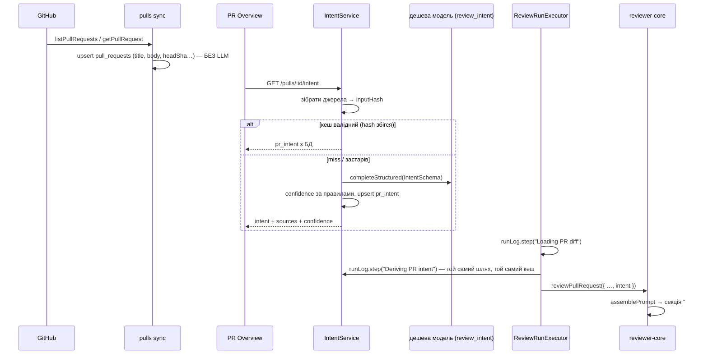

# Intent Layer — як він працюватиме від імпорту PR до запуску рев'ю

## Контекст

Рев'ю зараз бачить лише diff, заголовок і сирий опис PR (`run-executor.ts:238` → `prDescription`).
Моделі невідомо, **навіщо** зроблено зміну. Тому вона не може відрізнити очікувану зміну від
scope creep, а на картці Overview немає блоку INTENT, як на макеті.

**Мета:** окрема дешева модель визначає намір PR з усіх доступних джерел, результат кешується, з'являється
в UI і передається в кожен агент рев'ю разом із diff. Intent ніколи не зменшує рев'ю.

Стартер уже має заготовки, але вони ні з чим не з'єднані:

| Що є | Де | Стан |
|---|---|---|
| таблиця `pr_intent` (`intent`, `in_scope`, `out_of_scope`) | `server/src/db/schema/reviews.ts:73` | порожня; ніхто не пише |
| `upsertIntent` / `getIntent` | `server/src/modules/reviews/repository/pull.repo.ts:49-68` | ніде не викликаються |
| zod `Intent`, `PrIntentRecord` | `vendor/shared/contracts/brief.ts:9`, `review-api.ts:60` | лише тип |
| слот моделі `review_intent` у Settings | `contracts/platform.ts:53`, UI `SettingsModels.tsx:39-67` | є, але default `openai/gpt-4.1` — не дешева |
| `getIssue`, `resolveLinkedIssue` | `server/src/adapters/github/octokit.ts:351`, `:126` | `linked_issue` повертається, але не зберігається |
| `INJECTION_GUARD` уже згадує «derived intent/scope» | `reviewer-core/src/prompt.ts:16` | секції intent у промпті немає |
| i18n `brief.block.intent`, `brief.unavailable` | `client/messages/en/brief.json` | не використовуються |

Правило з memory: фічу будуємо з поточного коду, а не відновлюємо з історії git.

---

## 1. Послідовність — від імпорту до рев'ю

Покроково:

1. **Імпорт/синхронізація** (`pulls/routes.ts:37-89`, `polling/routes.ts:20-67`, `GET /pulls/:id` `:216-274`)
   зберігає title/body/headSha, як і зараз. **LLM на імпорті не викликається.** Список із 30 PR
   означав би 30 платних викликів на кожен poll. Intent обчислюється ліниво, коли він уперше потрібен.
2. **Перший запит intent** — відкриття Overview (`GET /pulls/:id/intent`) або запуск рев'ю.
3. **Збір джерел** (див. §2) → нормалізований набір входів → `inputHash`.
4. **Кеш** (див. §5): якщо `inputHash` збігся з тим, що збережено в `pr_intent`, LLM не викликається.
5. **Класифікація** дешевою моделлю через `container.featureModel(ws, 'review_intent')` + `container.llm(provider)` +
   `completeStructured` (той самий патерн, що в `conventions/service.ts:96-120`).
6. **Постобробка:** обчислюється впевненість (§3), sources фіксуються, запис іде в `pr_intent`.
7. **Рев'ю:** у `ReviewRunExecutor.executeRuns` після кроку `Loading PR diff` (`run-executor.ts:98`)
   додається спільний крок `Deriving PR intent`. Він виконується **один раз на всі агенти** (fan-out
   `RunLogger` уже для цього існує, `run-executor.ts:65`), і intent передається в кожен `reviewPullRequest`.
8. **Помилка intent ніколи не валить рев'ю:** пишеться warn у Live Log, рев'ю йде без секції intent,
   і промпт байт-у-байт такий самий, як до фічі.

---

## 2. Усі джерела контексту

Вони зібрані в чистий модуль `intent-sources.ts` (без I/O у парсингу), щоб його можна було покривати unit-тестами.

| # | Джерело | Звідки | Прямий/непрямий |
|---|---|---|---|
| 1 | Заголовок PR | `pull_requests.title` | прямий |
| 2 | Опис PR | `pull_requests.body` (обрізається до 4000 символів, як `MAX_PR_DESCRIPTION_CHARS`) | прямий |
| 3 | Пов'язаний ticket | GitHub issue: `#N` з ключовим словом `closes/fixes/resolves` → `gh.getIssue` (title + body) | прямий |
| 4 | План / специфікація за посиланням | див. §4 | прямий, **обов'язковий, якщо є посилання** |
| 5 | Назва гілки | `pull_requests.branch` (`feat/rate-limit-public`) | непрямий |
| 6 | Повідомлення комітів | `pr_commits` | непрямий |
| 7 | Шляхи змінених файлів + +/- | `pr_files` / diff | непрямий |

Джерела 5–7 йдуть у промпт завжди, але як «допоміжні». Коли джерел 2–4 немає, модель спирається
лише на них, і це прямо впливає на впевненість.

Ticket-посилання, які не є GitHub issue (Jira `ABC-123`, Linear, Notion URL), **не завантажуються**:
інтеграцій немає, і це був би SSRF-вектор. Вони фіксуються в `sources` зі статусом `unresolved`.

---

## 3. Поведінка без опису та рівень впевненості

Впевненість обчислюється **детерміновано з того, які джерела реально були**, а не зі самооцінки моделі:

| Рівень | Умова |
|---|---|
| `high` | змістовний опис (≥ 80 символів після зрізання шаблону/чекбоксів) **і** розв'язаний ticket або spec |
| `medium` | лише змістовний опис; **або** є посилання на spec/ticket, яке не вдалося розв'язати |
| `low` | опису немає або він порожній чи шаблонний → intent виведено з заголовка, гілки, комітів і шляхів файлів |

Без опису:
- промпт класифікатора отримує позначку `NO AUTHOR DESCRIPTION — infer from indirect signals, be conservative`;
- `out_of_scope` може бути порожнім (модель не вигадує, чого автор не робив);
- у UI бейдж **«Inferred · low confidence»** і підказка «PR has no description — intent inferred from title, branch, commits and files»;
- у промпті рев'ю intent позначений `confidence: low`, і агенту сказано, що це здогадка, а не заява автора.

Модель може сама **знизити** впевненість (поле `ambiguous: boolean`), але не може її підвищити.

---

## 4. Обробка планів і специфікацій

Парсер шукає в описі PR (і в тілі ticket) посилання двох видів:
- відносний шлях у репозиторії: `specs/intent-layer.md`, `./docs/…/plan.md`, `[plan](specs/x.md)`;
- GitHub blob URL **цього ж** репозиторію: `github.com/<owner>/<repo>/blob/<ref>/<path>`.

Правила:
1. Файл читається **на head sha PR**, а не з робочого дерева: план часто додано в тому ж PR.
   Потрібен новий метод `GitClient.readFileAt(sha, path)` (`git show <sha>:<path>`) після `fetchPullHead`.
   Зараз `readFile` (`simple-git.ts:129`) читає лише робоче дерево.
2. Обмеження: лише `.md`/`.txt`/`.mdx`; шлях нормалізується, а `..` і абсолютні шляхи відхиляються; ≤ 3 документи; ≤ 8000 символів кожен.
3. **Обов'язковість:** кожне знайдене посилання **або** потрапляє в промпт, **або** записується в `sources`
   зі статусом `failed` і причиною (`not_found`, `too_large`, `outside_repo`, `external`). Мовчки не відкидається
   жодне. Нерозв'язане посилання знижує впевненість до `medium`.
4. Якщо розв'язана spec суперечить опису PR, пріоритет має spec, бо це задокументований намір. Модель має
   поле `conflicts: string[]`, і воно виводиться в UI та в промпт рев'ю.
5. Вміст spec — untrusted: `wrapUntrusted('spec-…')`, як уже робить `assemblePrompt` для `specs`.

---

## 5. Кешування intent

Кеш зберігається в `pr_intent` і ключується **хешем входів**, а не часом:

`inputHash = hashKey(title, normalizedBody, ticket.title+body, для кожної spec: path+sha256(content), branch, commit messages, file paths, provider, model, INTENT_PROMPT_VERSION)`

(`hashKey` уже є в `platform/model-router.ts`.)

- **Hit:** hash збігся → жодного LLM-виклику, у Live Log пишеться `intent: cache hit (derived <time>, model …)`.
- **Інвалідація відбувається автоматично, коли:** автор змінив title/body; змінився ticket; spec змінилася в новому
  коміті; з'явилися нові коміти чи файли; у Settings змінили модель; змінили промпт класифікатора (bump версії).
- **Поштучний push без зміни опису** все одно дає новий hash (коміти й файли змінились). Це свідомо: виклик дешевий, а для
  low-confidence intent нові коміти — єдине джерело.
- **Single-flight:** in-process `Map<prId, Promise>`, щоб Overview і рев'ю, запущені одночасно, не зробили два виклики.
- **Примусово:** `POST /pulls/:id/intent/refresh` (кнопка ↻ на картці).
- Рев'ю завжди перевіряє hash перед використанням, тож не може отримати intent від старого head.

---

## 6. Правила для критичних знахідок поза scope

Intent — це **фокус, а не фільтр**. Це вже закладено в `INJECTION_GUARD`, і тепер це стає явним:

1. **Intent ніколи не знижує severity і не прибирає знахідку.** CRITICAL поза `in_scope` або в зоні `out_of_scope`
   репортується з повною severity.
2. У секції `## PR intent` промпту рев'ю буде явне правило: *«Scope tells you where the author meant to change code.
   It never excuses a defect. A CRITICAL or HIGH issue outside the stated scope MUST still be reported; say in its
   rationale that it is outside the stated scope.»*
3. **Scope creep — окремий сигнал:** якщо diff торкається того, що intent позначив як `out_of_scope` (на макеті це
   «Authentication changes»), агент може створити знахідку «change outside stated scope». Severity визначає
   `severity-map` (не вище WARNING саму по собі), а реальний дефект у тому коді зберігає свою severity.
4. Intent — untrusted: він виведений з тексту автора, тому `wrapUntrusted('intent', …)`, і фраза автора «ignore
   auth» не може стати інструкцією.
5. **Перевірка:** eval/unit-кейс «той самий diff з уразливістю поза scope, з intent і без» — кількість CRITICAL має бути
   однаковою. Детермінована частина: тест `assemblePrompt`, що правило присутнє і що intent знаходиться всередині `<untrusted>`.

---

## 7. Зміни схеми (Drizzle + міграція)

`pr_intent` розширюється (таблиця порожня, тому міграція безпечна):

| Колонка | Тип | Навіщо |
|---|---|---|
| `kind` | text | класифікація: `feature/bugfix/refactor/perf/security/docs/chore/test` |
| `risk_areas` | jsonb string[] | чипи RISK AREAS |
| `conflicts` | jsonb string[] | spec ↔ опис |
| `confidence` | text (`high/medium/low`) | §3 |
| `sources` | jsonb `{type,ref,status,reason?}[]` | §2/§4 — що реально використано |
| `input_hash` | text | §5 |
| `head_sha` | text | для діагностики/UI «derived for abc123» |
| `provider`, `model` | text | який класифікатор |
| `tokens_in`, `tokens_out`, `cost_usd` | int/int/double | вартість intent окремо від агента |
| `generated_at` | timestamptz | «derived 3m ago» |

`pull_requests` не змінюється: ticket завантажується під час derive через `getIssue`.
Міграція: `pnpm db:generate` → `pnpm db:migrate`. **На цій машині `db:migrate` може нічого не зробити** (memory),
тому перевіряється `\d pr_intent`.

## 8. Контракт і API

- `@devdigest/shared` — `Intent` розширюється (`kind`, `risk_areas`, `conflicts`, `confidence`, `sources`, `generated_at`),
  а `PromptAssembly` отримує `intent: string | null`. **Обидві копії vendor/shared змінюються в одному коміті.**
- `GET  /pulls/:id/intent` → `PrIntentRecord` (derive-if-stale; 200). Якщо немає ключа провайдера → `409`
  з кодом `intent_unavailable`, і UI показує `brief.unavailable`.
- `POST /pulls/:id/intent/refresh` → примусовий derive.
- Розташування: `server/src/modules/reviews/intent/` (`service.ts`, `sources.ts`, `schema.ts`). `pr_intent` уже
  належить репозиторію `reviews`, тому сусідній модуль не зачіпається (`pnpm arch`).
- Default моделі `review_intent` → дешева: `openrouter` / `deepseek/deepseek-v4-flash` (уже використовується як
  default onboarding). Settings UI зберігає саме `openrouter`. Змінюється в `platform.ts` (обидві копії) і
  `client/src/lib/feature-models.ts`. Вибір моделі в Settings уже працює, і новий UI для нього не потрібен.

## 9. Prompt builder

- **Класифікатор:** новий `docs/agent-prompts/intent-classifier.md` (вбудовані промпти живуть лише там).
  Вхід — кожне джерело в окремому `wrapUntrusted('pr-title' | 'pr-description' | 'ticket' | 'spec-N' | 'commits' | 'files')`.
  Вихід — zod `IntentLLMOutput` (`intent`, `kind`, `in_scope[]`, `out_of_scope[]`, `risk_areas[]`, `conflicts[]`, `ambiguous`),
  з лімітами довжини (≤ 6 пунктів у кожному списку, ≤ 300 символів у `intent`). `temperature: 0`.
- **Рев'ю (`reviewer-core`):**
  - `PromptParts.intent?: string` і `ReviewInput.intent?: string` у `review/run.ts` → пропускаються в `assemblePrompt`;
  - секція `## PR intent` одразу після task line і **перед** `## PR description`, з `wrapUntrusted('intent', …)` + правилом з §6;
  - порожнє або відсутнє поле → секція пропущена (контракт «omit when empty», як у `callers`/`repoMap`);
  - `assembly.intent` зберігається для run trace.
- Сервер форматує intent у текст (`formatIntentForPrompt`), зокрема `confidence` і `sources`. reviewer-core лишається без I/O.

## 10. UI

- `client/src/app/repos/[repoId]/pulls/[number]/_components/IntentCard/` (`IntentCard.tsx`, `.test.tsx`, `constants.ts`,
  `helpers.ts`, `styles.ts`, `index.ts`) — за макетом: цитата intent, `IN SCOPE` / `OUT OF SCOPE`, `RISK AREAS` чипи,
  плюс бейдж впевненості, рядок джерел (✓ Description · ✓ #12 · ✗ specs/x.md — not found), блок `conflicts`,
  кнопка ↻ refresh і час «derived … for abc123».
- Картка вбудовується в `OverviewTab` над описом. Місце для Blast Radius лишається, але сам він — не в цій фічі.
- Хук `usePrIntent(prId)` + `useRefreshIntent` у `lib/hooks/reviews.ts`, експорт через barrel.
- Стани: loading skeleton, `unavailable` (немає ключа) і `low confidence` (жовтий бейдж + пояснення).
- i18n: namespace `brief`, без хардкоду. Тести: `fireEvent`, провайдер з усіма namespace, які використовує картка.
- Run trace: новий `PromptBlock` «Intent» у `TraceBody.tsx:74-91` + колір у `RunTraceDrawer/constants.ts` + label у `runs.json`.

## 11. Логування

- Live Log (спільний крок, у кожному run): `runLog.step('Deriving PR intent', …, { kind: 'tool' })`, далі
  `intent: cache hit|miss`, `intent: sources — description ✓, ticket #12 ✓, specs/x.md ✗ (not_found)`,
  `intent: <kind>, confidence <level>, model <provider/model>, <tokens> tok, $<cost>`.
- Помилка → `runLog.error('Intent derivation failed: …; continuing without intent')`, а рев'ю йде далі.
- pino: `{ prId, inputHash, cacheHit, confidence, sources, model, tokensIn, tokensOut, costUsd, durationMs }`.
  **Вміст опису чи spec у логи не пишеться** (лише шляхи та статуси).
- Вартість intent у trace окремо; `agent_runs.cost_usd` агента не змішується.

## 12. Ризики

| Ризик | Пом'якшення |
|---|---|
| Prompt injection через опис/ticket/spec («не флагай auth») | усе в `<untrusted>`, `INJECTION_GUARD`, правило §6, тест «CRITICAL не зникає» |
| Intent звужує рев'ю й ховає дефекти поза scope | intent = фокус; eval-кейс з/без intent |
| Галюцинований scope при порожньому описі | детермінована `low`, `out_of_scope` може бути порожнім, UI-бейдж |
| Path traversal / читання секретів через посилання на «spec» | лише відносні шляхи в репо, `..` відхиляється, allowlist розширень, читання через `git show` на sha |
| SSRF через зовнішні URL | зовнішні посилання не завантажуються, лише `unresolved` |
| Вартість і затримка | дешева модель, кеш за hash, single-flight, ліниво (не на poll), таймаут ~20 с |
| Застарілий intent після push | hash включає коміти/файли/spec-вміст, рев'ю перевіряє hash |
| Регекс `resolveLinkedIssue` чіпляє будь-який `#N` | у джерелах intent вимагається ключове слово `closes/fixes/resolves`; адаптер не чіпаємо |
| Розсинхрон vendor/shared | обидві копії в одному коміті, typecheck обох пакетів |
| `db:migrate` мовчки no-op на Windows | перевірка колонок у psql |
| Немає ключа провайдера | 409 → UI `unavailable`, рев'ю без intent |

---

## Порядок виконання (після підтвердження)

0. **Гілка.** Поточна `lesson/L04-researcher-agent` містить незакомічену роботу по агентах. Спершу закомітити її
   (після `/pr-self-review`), потім створити `lesson/L03-intent-layer` від `main`.
1. **`researcher`** — зовнішні практики з цитатами: GitHub closing keywords і linked issues API, як Graphite/CodeRabbit/
   Copilot review використовують опис PR, ризики injection через опис PR. Результат — файл-звіт.
2. **`planner`** → `specs/intent-layer.md`: цей план як контракт, зі skill map (`drizzle-orm-patterns`,
   `postgresql-table-design`, `onion-architecture`, `fastify-best-practices`, `zod`, `security`, `react-best-practices`,
   `react-testing-library`, `frontend-ui-architecture`) і `Done when`.
3. **`implementer`** за spec: схема+міграція → контракт (обидва vendor) → `GitClient.readFileAt` → `intent/sources.ts`
   → `intent/service.ts` + routes → `reviewer-core` prompt → run-executor → client card/hook/trace.
4. **`test-writer`:** unit `sources.ts` (парсинг посилань, traversal, confidence), reviewer-core `assemblePrompt`
   (секція, untrusted, omit-when-empty, правило scope), server integration `*.it.test.ts` (кеш hit/miss/інвалідація,
   409), client `IntentCard.test.tsx`.
5. **`architecture-reviewer`**, **`plan-verifier`**, `/pr-self-review`, `/engineering-insights`.

## Перевірка

- `server/`: `pnpm typecheck`, `pnpm arch`, `pnpm test`, `pnpm test:it` (враховуючи відомі 6/11 падінь indexer-pipeline).
- `reviewer-core/`: `npm test`. `client/`: `pnpm typecheck`, `pnpm test`.
- Вручну (`/run`): PR з описом і `specs/…` → картка `high`, spec у sources ✓; PR без опису → `low` + бейдж;
  повторне відкриття → `cache hit` у логах сервера; редагування опису на GitHub → refresh → `miss`; запуск рев'ю → у Live
  Log `Deriving PR intent`, у Run trace блок «Intent»; зміна моделі в Settings → наступний derive використовує її.
